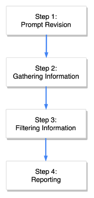

# Advanced RAG Websearch
This project demonstrates how to automate a classic web research with a LLM and RAG.
The process is divided in four substeps:

1. <b>Prompt Revision:</b> Understand the human input and generate an optimized prompt for the requested task (e.g. question answering, research, recommendations, ...)

2. <b>Gathering Information:</b> Open the websites, extract relevant content and optimize it for machine processing

3. <b>Filtering Information:</b> Interpretation of the human input and decide what content of step 2 is the most relevant information to answer the question

4. <b>Reporting:</b> Putting together all relevant information fragments and give the user a summarized output with all source URLs

There are samples for each step in the "examples" folder.

Also see my articles for further description:
- Self-induced Prompt Optimization: ...
