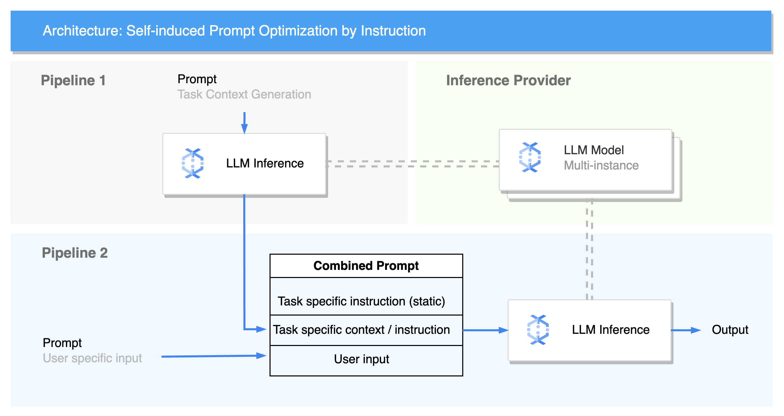
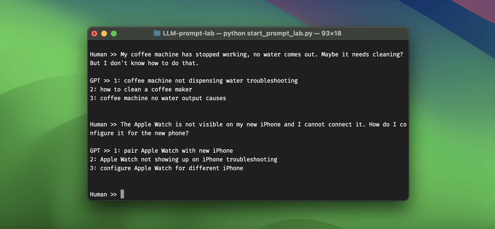

## Self-induced Prompt Optimization
An approach to optimize user input with LLM's knowledge about the specific task itself.

### Example for generating web search queries



Can be used e.g. to re-formulate some user input to short queries optimized for input to a search engine like Google or Bing.



### Example for generating process descriptions with pseudocode

Prompt input:

> <sup>The program for evaluating fuel prices opens a textfile and checks, if there is correct formatted data in CSV format. Then, it puts all the data into an array and converts the column with the name "Total amount" to integers and the one with the name "Current price" to float. Then multiply "Current price" with "Total amount" in all rows with the value "Gasoline" in column "Type". </sup>

LLM Output:

``` bash
# Process Title: Evaluate Fuel Prices
# Objective: Process a CSV file to calculate the total cost for gasoline entries.

# Input: Text file containing fuel data in CSV format.
# Output: Array with calculated total costs for gasoline entries.

# Initialize variables
Open the text file for reading
Initialize an empty array for storing processed data

# Step 1: Validate CSV Data Format
# Check if the data in the text file is in correct CSV format
Read the first line of the file and check for correct headers

# Step 2: Read and Store Data
# Read each line from the file, split by commas, and store it in an array
While not end of file:
    Read line and split by comma to form a list
    Append list to array

# Step 3: Convert Data Types
# Convert "Total amount" to integer and "Current price" to float for each entry
For each row in array:
    Convert row["Total amount"] to integer
    Convert row["Current price"] to float

# Step 4: Calculate Total Cost for Gasoline Entries
# Multiply "Current price" with "Total amount" where "Type" is "Gasoline"
For each row in array:
    If row["Type"] equals "Gasoline":
        Multiply row["Current price"] by row["Total amount"]
        Store result back into array or a new result structure

# Termination or Finalization
Close the text file
Return or output the modified array with calculated costs
```


Further description:
- medium link TODO
